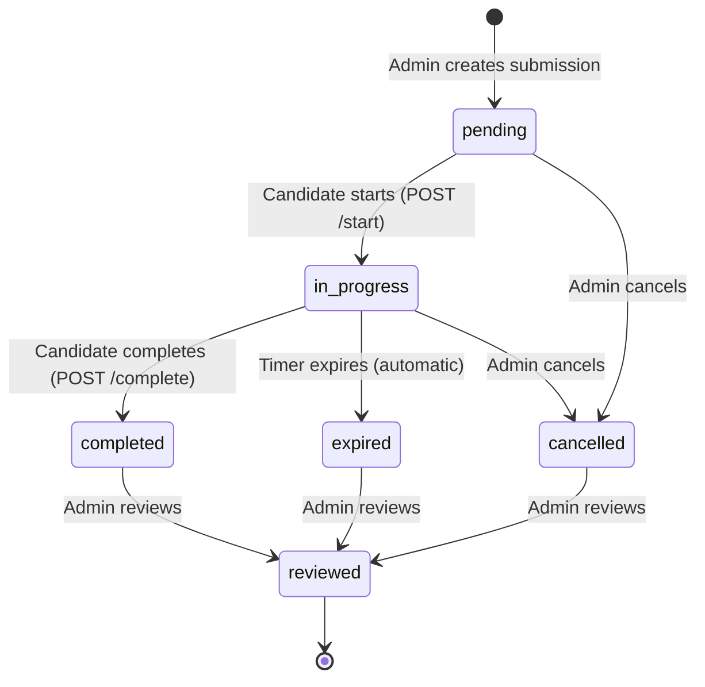
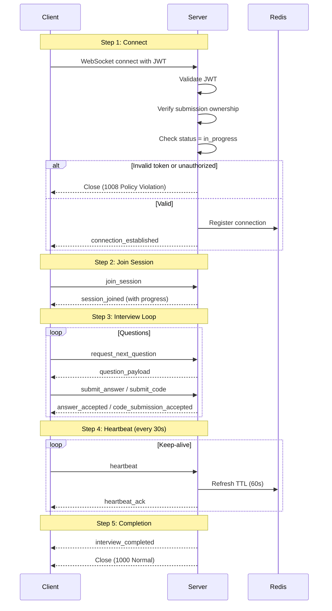
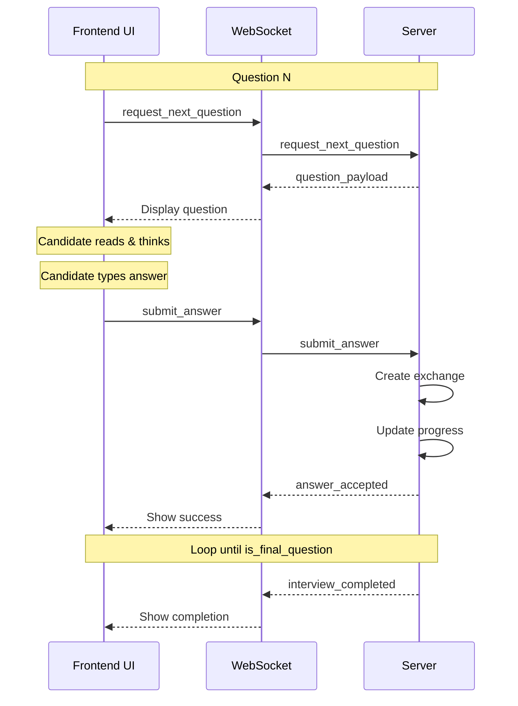
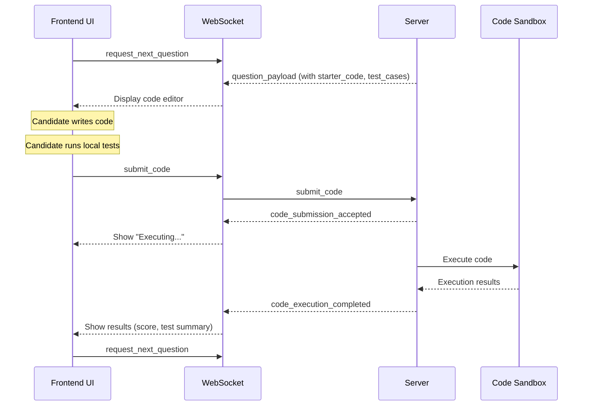
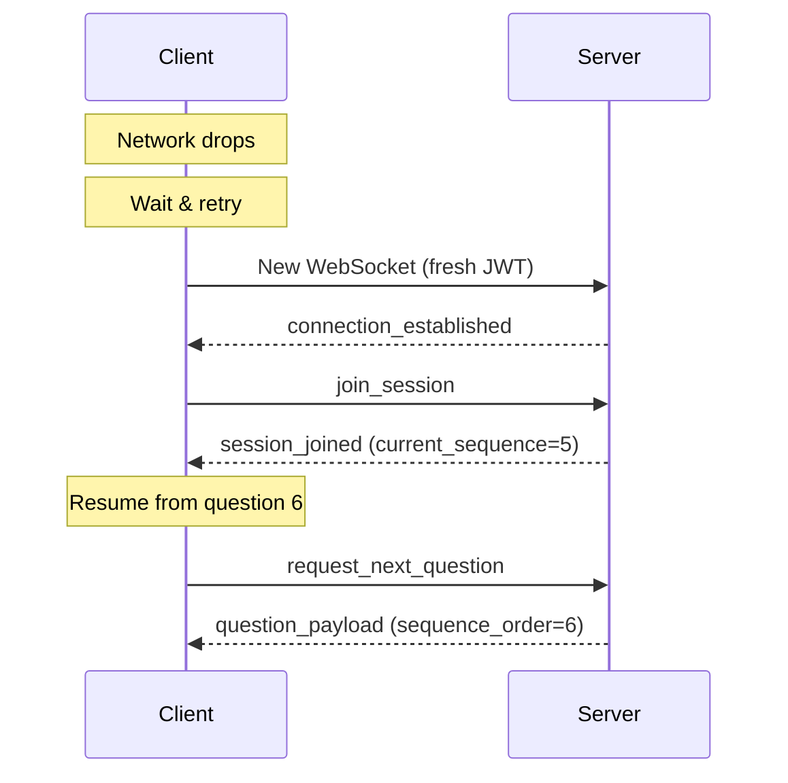

# Frontend Integration Guide — Interview Flow & WebSocket Protocol

This document provides everything a frontend developer needs to integrate with the AI Interviewer backend, including:

- Complete interview lifecycle flow
- REST API endpoints for session management
- WebSocket connection protocol
- All event contracts (client ↔ server)
- Error handling patterns
- State diagrams and sequence diagrams

---

## Table of Contents

1. [Interview Lifecycle Overview](#1-interview-lifecycle-overview)
2. [Session State Machine](#2-session-state-machine)
3. [REST API Endpoints](#3-rest-api-endpoints)
4. [WebSocket Connection Protocol](#4-websocket-connection-protocol)
5. [WebSocket Events — Client to Server](#5-websocket-events--client-to-server)
6. [WebSocket Events — Server to Client](#6-websocket-events--server-to-client)
7. [Interview Question Flow](#7-interview-question-flow)
8. [Coding Questions Flow](#8-coding-questions-flow)
9. [Error Handling](#9-error-handling)
10. [Reconnection & Recovery](#10-reconnection--recovery)
11. [Complete Integration Example](#11-complete-integration-example)

---

## 1. Interview Lifecycle Overview

The interview follows a structured flow from scheduling to completion:

```
┌─────────────────────────────────────────────────────────────────────────────┐
│                        INTERVIEW LIFECYCLE FLOW                              │
├─────────────────────────────────────────────────────────────────────────────┤
│                                                                             │
│  1. SCHEDULING (Admin creates submission)                                   │
│     └─ Status: PENDING                                                      │
│                                                                             │
│  2. START (Candidate starts via REST API)                                   │
│     └─ POST /api/v1/interviews/sessions/start                               │
│     └─ Status: PENDING → IN_PROGRESS                                        │
│                                                                             │
│  3. CONNECT (Candidate opens WebSocket)                                     │
│     └─ ws://host/ws/interview/{submission_id}?token=JWT                     │
│     └─ Server sends: connection_established                                 │
│                                                                             │
│  4. JOIN SESSION (Get current state)                                        │
│     └─ Client sends: join_session                                           │
│     └─ Server sends: session_joined (with progress)                         │
│                                                                             │
│  5. INTERVIEW LOOP                                                          │
│     ┌─────────────────────────────────────────────┐                         │
│     │  a. Client sends: request_next_question     │                         │
│     │  b. Server sends: question_payload          │                         │
│     │  c. Candidate answers                       │                         │
│     │  d. Client sends: submit_answer/submit_code │                         │
│     │  e. Server sends: answer_accepted           │                         │
│     │  f. Loop until all questions done           │                         │
│     └─────────────────────────────────────────────┘                         │
│                                                                             │
│  6. COMPLETION                                                              │
│     └─ Automatic: All questions answered                                    │
│     └─ Manual: POST /api/v1/interviews/sessions/complete                    │
│     └─ Timeout: Server expires interview                                    │
│     └─ Status: IN_PROGRESS → COMPLETED/EXPIRED                              │
│                                                                             │
│  7. DISCONNECT                                                              │
│     └─ Close WebSocket connection                                           │
│                                                                             │
└─────────────────────────────────────────────────────────────────────────────┘
```

---

## 2. Session State Machine

### State Diagram



### State Definitions

| State | Description | Can Transition To |
|-------|-------------|-------------------|
| `pending` | Scheduled but not started | `in_progress`, `cancelled` |
| `in_progress` | Candidate is actively taking interview | `completed`, `expired`, `cancelled` |
| `completed` | Candidate submitted answers | `reviewed` |
| `expired` | Interview timed out | `reviewed` |
| `cancelled` | Admin cancelled interview | `reviewed` |
| `reviewed` | Admin has reviewed (terminal) | *none* |

### Critical Rules

1. **No backward transitions**: Once `in_progress`, cannot go back to `pending`
2. **No skipping**: Cannot go from `pending` directly to `completed`
3. **Terminal state**: `reviewed` is final — no further changes

---

## 3. REST API Endpoints

### Base URL

```
https://api.example.com/api/v1/interviews
```

### Start Interview

**Transition**: `pending` → `in_progress`

```http
POST /sessions/start
Authorization: Bearer <JWT>
Content-Type: application/json

{
  "submission_id": 123,
  "consent_accepted": true
}
```

**Response** (200 OK):
```json
{
  "submission_id": 123,
  "candidate_id": 42,
  "status": "in_progress",
  "mode": "self_paced",
  "consent_captured": true,
  "started_at": "2026-03-08T10:00:00Z",
  "created_at": "2026-03-07T09:00:00Z"
}
```

### Get Session Status

```http
GET /sessions/{submission_id}/status
Authorization: Bearer <JWT>
```

**Response** (200 OK):
```json
{
  "submission_id": 123,
  "candidate_id": 42,
  "status": "in_progress",
  "mode": "self_paced",
  "consent_captured": true,
  "started_at": "2026-03-08T10:00:00Z",
  "created_at": "2026-03-07T09:00:00Z",
  "submitted_at": null,
  "time_remaining_seconds": 3450,
  "current_sequence": 3,
  "total_questions": 8,
  "progress_percentage": 37.5,
  "exchanges": [
    {
      "id": 1,
      "sequence_order": 1,
      "question_text": "Tell me about your experience...",
      "difficulty_at_time": "medium",
      "response_text": "I have worked on...",
      "response_time_ms": 45000
    }
  ]
}
```

### Complete Interview

**Transition**: `in_progress` → `completed`

```http
POST /sessions/complete
Authorization: Bearer <JWT>
Content-Type: application/json

{
  "submission_id": 123
}
```

### Get Interview Progress

```http
GET /{submission_id}/progress
Authorization: Bearer <JWT>
```

**Response** (200 OK):
```json
{
  "submission_id": 123,
  "current_sequence": 5,
  "total_questions": 8,
  "progress_percentage": 62.5,
  "section_progress": {
    "resume": { "completed": 2, "total": 2 },
    "behavioral": { "completed": 2, "total": 3 },
    "coding": { "completed": 1, "total": 3 }
  }
}
```

### List Exchanges (Audit Trail)

```http
GET /{submission_id}/exchanges?include_responses=true&section=behavioral
Authorization: Bearer <JWT>
```

---

## 4. WebSocket Connection Protocol

### Connection URL

```
wss://api.example.com/ws/interview/{submission_id}?token=<JWT>
```

> **Note**: The path segment is `/ws/interview/` (singular). Do **not** use `/ws/interviews/` (plural) — it will return 404.

| Parameter | Type | Description |
|-----------|------|-------------|
| `submission_id` | Path | Interview submission ID |
| `token` | Query | JWT access token (candidate) |

### Connection Lifecycle



### Connection Replacement

Only **one active WebSocket** per submission is allowed. If the candidate:

1. Opens a new tab/device
2. Reconnects after network drop

The server will:

1. Send `connection_replaced` to the OLD connection
2. Close the OLD connection
3. Accept the NEW connection

```json
// Sent to OLD connection before closing
{
  "event_type": "connection_replaced",
  "message": "New connection established from another client. This connection will close.",
  "new_connection_id": "conn_xyz789",
  "timestamp": "2026-03-08T10:15:00Z"
}
```

### Heartbeat Mechanism

**Client MUST send heartbeats every 30 seconds** to keep the connection alive.

```javascript
// Client-side implementation
setInterval(() => {
  ws.send(JSON.stringify({
    event_type: "heartbeat",
    timestamp: new Date().toISOString()
  }));
}, 30000);
```

If no heartbeat is received for **60 seconds**, the server considers the connection dead and cleans up.

---

## 5. WebSocket Events — Client to Server

All events sent from client to server follow this structure:

```typescript
interface ClientEvent {
  event_type: string;
  // ... event-specific fields
}
```

### 5.1 `join_session`

**Purpose**: Initialize session after WebSocket connection, get current state.

**When to send**: Immediately after receiving `connection_established`.

```json
{
  "event_type": "join_session",
  "submission_id": 123
}
```

**Server responds with**: `session_joined` or `interview_completed` (if already done)

---

### 5.2 `request_next_question`

**Purpose**: Request the next question in the interview sequence.

**When to send**: After receiving `session_joined` or `answer_accepted`.

```json
{
  "event_type": "request_next_question",
  "submission_id": 123
}
```

**Server responds with**: `question_payload` or `interview_completed`

---

### 5.3 `submit_answer`

**Purpose**: Submit a text answer for the current question.

**When to send**: After candidate finishes answering a non-coding question.

```json
{
  "event_type": "submit_answer",
  "exchange_id": 5,
  "response_text": "My approach to problem-solving involves...",
  "response_time_ms": 45000
}
```

| Field | Type | Description |
|-------|------|-------------|
| `exchange_id` | number | Sequence order from `question_payload` |
| `response_text` | string | Candidate's text response |
| `response_time_ms` | number | Time taken in milliseconds (must be > 0) |

**Server responds with**: `answer_accepted`

---

### 5.4 `submit_code`

**Purpose**: Submit code for a coding question.

**When to send**: After candidate completes a coding problem.

```json
{
  "event_type": "submit_code",
  "exchange_id": 7,
  "response_code": "def two_sum(nums, target):\n    seen = {}\n    for i, num in enumerate(nums):\n        if target - num in seen:\n            return [seen[target - num], i]\n        seen[num] = i\n    return []",
  "response_language": "python",
  "response_time_ms": 180000
}
```

| Field | Type | Description |
|-------|------|-------------|
| `exchange_id` | number | Sequence order from `question_payload` |
| `response_code` | string | Source code (1–100,000 chars) |
| `response_language` | string | `"python"`, `"java"`, or `"cpp"` |
| `response_time_ms` | number | Time taken in milliseconds (must be > 0) |

**Server responds with**: `code_submission_accepted` (immediate), then `code_execution_completed` (async)

---

### 5.5 `heartbeat`

**Purpose**: Keep connection alive, refresh server-side TTL.

**When to send**: Every 30 seconds.

```json
{
  "event_type": "heartbeat",
  "timestamp": "2026-03-08T10:15:30Z"
}
```

**Server responds with**: `heartbeat_ack`

---

## 6. WebSocket Events — Server to Client

### 6.1 `connection_established`

**Purpose**: Confirm WebSocket connection is accepted and active.

**When received**: Immediately after successful connection.

```json
{
  "event_type": "connection_established",
  "submission_id": 123,
  "connection_id": "conn_abc123",
  "server_time": "2026-03-08T10:00:00Z"
}
```

**Next step**: Send `join_session`

---

### 6.2 `session_joined`

**Purpose**: Return current interview state after joining.

**When received**: After sending `join_session`.

```json
{
  "event_type": "session_joined",
  "submission_id": 123,
  "submission_status": "in_progress",
  "current_sequence": 3,
  "total_questions": 8,
  "progress_percentage": 37.5,
  "time_remaining_seconds": 3450,
  "started_at": "2026-03-08T10:00:00Z",
  "expires_at": "2026-03-08T11:00:00Z"
}
```

| Field | Type | Description |
|-------|------|-------------|
| `submission_status` | string | Current status (`in_progress`, etc.) |
| `current_sequence` | number | Number of questions already completed (0-indexed) |
| `total_questions` | number | Total questions in interview |
| `progress_percentage` | number | Progress as percentage (0-100) |
| `time_remaining_seconds` | number | Seconds until interview expires (nullable) |
| `started_at` | string | ISO timestamp when interview started |
| `expires_at` | string | ISO timestamp when interview will expire (nullable) |

**Next step**: Send `request_next_question`

---

### 6.3 `question_payload`

**Purpose**: Deliver the next question to the candidate.

**When received**: After sending `request_next_question`.

```json
{
  "event_type": "question_payload",
  "exchange_id": 4,
  "sequence_order": 4,
  "question_text": "Describe a challenging project you worked on.",
  "question_type": "behavioral",
  "question_difficulty": "medium",
  "section_name": "behavioral",
  "time_limit_seconds": 300,
  "is_final_question": false
}
```

**For coding questions**:

```json
{
  "event_type": "question_payload",
  "exchange_id": 7,
  "sequence_order": 7,
  "question_text": "Given an array of integers nums and an integer target, return indices of the two numbers such that they add up to target.",
  "question_type": "coding",
  "question_difficulty": "easy",
  "section_name": "coding",
  "time_limit_seconds": 1800,
  "is_final_question": false,
  "starter_code": "def two_sum(nums: List[int], target: int) -> List[int]:\n    # Your code here\n    pass",
  "test_cases": [
    { "input": "[2,7,11,15], 9", "expected": "[0,1]" },
    { "input": "[3,2,4], 6", "expected": "[1,2]" }
  ]
}
```

| Field | Type | Description |
|-------|------|-------------|
| `exchange_id` | number | Unique ID for this exchange (use when submitting) |
| `sequence_order` | number | 1-based position in interview (1, 2, 3...) |
| `question_text` | string | The question to display |
| `question_type` | string | `"behavioral"`, `"technical"`, `"situational"`, `"coding"` |
| `question_difficulty` | string | `"easy"`, `"medium"`, `"hard"` |
| `section_name` | string | Interview section |
| `time_limit_seconds` | number | Time limit for this question (nullable) |
| `is_final_question` | boolean | True if this is the last question |
| `starter_code` | string | For coding questions: initial code template (nullable) |
| `test_cases` | array | For coding questions: visible test cases (nullable) |

**Next step**: Display question, wait for answer, send `submit_answer` or `submit_code`

---

### 6.4 `answer_accepted`

**Purpose**: Confirm text answer was recorded successfully.

**When received**: After sending `submit_answer`.

```json
{
  "event_type": "answer_accepted",
  "exchange_id": 4,
  "sequence_order": 4,
  "next_sequence": 5,
  "progress_percentage": 50.0,
  "message": "Answer submitted successfully!"
}
```

| Field | Type | Description |
|-------|------|-------------|
| `next_sequence` | number | Next question's sequence order (nullable if complete) |
| `progress_percentage` | number | Updated progress percentage |

**Next step**: Send `request_next_question`

---

### 6.5 `code_submission_accepted`

**Purpose**: Acknowledge code was received, execution is in progress.

**When received**: Immediately after sending `submit_code`.

```json
{
  "event_type": "code_submission_accepted",
  "exchange_id": 7,
  "code_submission_id": 456,
  "execution_status": "pending",
  "message": "Code submitted successfully. Execution in progress...",
  "estimated_execution_time_seconds": 10
}
```

**Next step**: Wait for `code_execution_completed`

---

### 6.6 `code_execution_completed`

**Purpose**: Report code execution results.

**When received**: Asynchronously after `code_submission_accepted`.

```json
{
  "event_type": "code_execution_completed",
  "exchange_id": 7,
  "code_submission_id": 456,
  "execution_status": "success",
  "score": 80.0,
  "test_results_summary": "8/10 test cases passed",
  "execution_time_ms": 1250,
  "next_sequence": 8,
  "progress_percentage": 87.5
}
```

| Field | Type | Description |
|-------|------|-------------|
| `execution_status` | string | `"success"`, `"error"`, `"timeout"` |
| `score` | number | Score from test cases (0-100) |
| `test_results_summary` | string | Human-readable test summary |
| `execution_time_ms` | number | Code execution time |

**Next step**: Send `request_next_question`

---

### 6.7 `timer_update`

**Purpose**: Periodic time remaining broadcast.

**When received**: Every 60 seconds during active interview.

```json
{
  "event_type": "timer_update",
  "time_remaining_seconds": 1800,
  "progress_percentage": 62.5,
  "current_sequence": 5,
  "total_questions": 8
}
```

**Action**: Update timer display in UI.

---

### 6.8 `progress_update`

**Purpose**: Updated progress after each exchange.

**When received**: After exchange creation.

```json
{
  "event_type": "progress_update",
  "current_sequence": 5,
  "total_questions": 8,
  "progress_percentage": 62.5,
  "section_progress": {
    "resume": { "completed": 2, "total": 2 },
    "behavioral": { "completed": 2, "total": 3 },
    "coding": { "completed": 1, "total": 3 }
  }
}
```

**Action**: Update progress bar/indicator.

---

### 6.9 `interview_completed`

**Purpose**: Notify interview is finished (all questions or manual submit).

**When received**: After all questions answered, or if already completed on join.

```json
{
  "event_type": "interview_completed",
  "submission_id": 123,
  "completion_reason": "all_questions_answered",
  "submitted_at": "2026-03-08T10:45:00Z",
  "exchanges_completed": 8,
  "total_questions": 8,
  "message": "Interview completed successfully!",
  "next_steps": "Results will be available within 24 hours."
}
```

| Field | Type | Description |
|-------|------|-------------|
| `completion_reason` | string | `"all_questions_answered"` or `"submitted"` |
| `submitted_at` | string | ISO timestamp of completion |
| `exchanges_completed` | number | How many questions were answered |

**Action**: Show completion screen, close WebSocket gracefully.

---

### 6.10 `interview_expired`

**Purpose**: Notify interview timed out.

**When received**: When interview timer expires.

```json
{
  "event_type": "interview_expired",
  "submission_id": 123,
  "expired_at": "2026-03-08T11:00:00Z",
  "exchanges_completed": 5,
  "total_questions": 8,
  "auto_submitted": true,
  "message": "Interview time expired. Your responses have been automatically submitted."
}
```

**Action**: Show expiration message, WebSocket will close automatically.

---

### 6.11 `connection_replaced`

**Purpose**: Notify this connection is being replaced by a new one.

**When received**: When candidate opens a new connection from another tab/device.

```json
{
  "event_type": "connection_replaced",
  "message": "New connection established from another client. This connection will close.",
  "new_connection_id": "conn_xyz789",
  "timestamp": "2026-03-08T10:15:00Z"
}
```

**Action**: Show message, do NOT attempt to reconnect automatically.

---

### 6.12 `heartbeat_ack`

**Purpose**: Acknowledge heartbeat received.

**When received**: After sending `heartbeat`.

```json
{
  "event_type": "heartbeat_ack",
  "server_time": "2026-03-08T10:15:30Z",
  "time_remaining_seconds": 2700
}
```

**Action**: Update server time sync if needed.

---

### 6.13 `error_event`

**Purpose**: Report error to client.

**When received**: On validation errors or server issues.

```json
{
  "event_type": "error_event",
  "error_code": "VALIDATION_ERROR",
  "message": "Invalid exchange_id",
  "details": { "provided": 999, "expected_range": [1, 8] },
  "timestamp": "2026-03-08T10:20:00Z"
}
```

| Error Code | Description | Fatal? |
|------------|-------------|--------|
| `VALIDATION_ERROR` | Invalid event format/data | No |
| `NOT_FOUND` | Resource does not exist | No |
| `INTERVIEW_NOT_ACTIVE` | Interview is not in_progress | Yes |
| `UNAUTHORIZED` | Not allowed to access | Yes |
| `SERVER_ERROR` | Internal server error | Yes |

**Fatal errors** will close the WebSocket connection.

---

## 7. Interview Question Flow

### Complete Question-Answer Sequence



### Template Snapshot & Sections

Questions are delivered in a **deterministic order** based on the template snapshot:

```json
{
  "template_id": 3,
  "template_name": "Full Stack Engineer Interview",
  "sections": [
    {
      "section_name": "resume",
      "question_count": 2,
      "question_ids": [101, 102]
    },
    {
      "section_name": "behavioral",
      "question_count": 3,
      "question_ids": [201, 202, 203]
    },
    {
      "section_name": "coding",
      "question_count": 3,
      "question_ids": [301, 302, 303]
    }
  ],
  "total_questions": 8
}
```

**Sequence flattening**:

| Sequence | Section | Question ID |
|----------|---------|-------------|
| 1 | resume | 101 |
| 2 | resume | 102 |
| 3 | behavioral | 201 |
| 4 | behavioral | 202 |
| 5 | behavioral | 203 |
| 6 | coding | 301 |
| 7 | coding | 302 |
| 8 | coding | 303 |

---

## 8. Coding Questions Flow

Coding questions have an additional asynchronous execution step:



### Supported Languages

| Language | Value |
|----------|-------|
| Python | `"python"` |
| Java | `"java"` |
| C++ | `"cpp"` |

### Execution Statuses

| Status | Description |
|--------|-------------|
| `pending` | Queued for execution |
| `success` | Executed without errors |
| `error` | Compilation or runtime error |
| `timeout` | Execution exceeded time limit |

---

## 9. Error Handling

### Error Response Structure

```json
{
  "event_type": "error_event",
  "error_code": "ERROR_CODE_HERE",
  "message": "Human-readable description",
  "details": { /* optional context */ },
  "timestamp": "2026-03-08T10:20:00Z"
}
```

### Error Codes Reference

| Code | HTTP Equiv | Description | Recovery |
|------|------------|-------------|----------|
| `VALIDATION_ERROR` | 400 | Invalid payload format | Fix and retry |
| `NOT_FOUND` | 404 | Submission/exchange not found | Check ID |
| `CONFLICT` | 409 | State transition invalid | Refresh state |
| `INTERVIEW_NOT_ACTIVE` | 409 | Submission not in_progress | Cannot continue |
| `UNAUTHORIZED` | 403 | No permission | Re-authenticate |
| `AUTHENTICATION_ERROR` | 401 | Invalid/expired token | Get new token |
| `SERVER_ERROR` | 500 | Internal error | Retry or report |

### Handling Errors in UI

```javascript
// Error handler example
ws.onmessage = (event) => {
  const data = JSON.parse(event.data);
  
  if (data.event_type === 'error_event') {
    const { error_code, message, details } = data;
    
    switch (error_code) {
      case 'VALIDATION_ERROR':
        // Show inline error, allow retry
        showError(message);
        break;
        
      case 'INTERVIEW_NOT_ACTIVE':
      case 'UNAUTHORIZED':
        // Fatal — redirect to dashboard
        showError(message);
        redirectToDashboard();
        break;
        
      case 'SERVER_ERROR':
        // Show retry option
        showError('Something went wrong. Please try again.');
        break;
    }
  }
};
```

---

## 10. Reconnection & Recovery

### Automatic State Recovery

When reconnecting after a network interruption:

1. Open new WebSocket with fresh JWT
2. Server validates and accepts
3. Send `join_session`
4. Server returns `session_joined` with **current state**
5. Resume from `current_sequence`



### State Preserved on Disconnect

- ✅ All submitted answers (persisted immediately)
- ✅ Current progress (`current_exchange_sequence`)
- ✅ Interview timer (server-side)

### State Lost on Disconnect

- ❌ In-progress text (not submitted yet)
- ❌ Unsaved code (not submitted yet)

**Recommendation**: Auto-save drafts to localStorage.

### Reconnection Best Practices

```javascript
// Client reconnection with exponential backoff
let reconnectAttempts = 0;
const MAX_RECONNECT_ATTEMPTS = 5;

function connect() {
  ws = new WebSocket(`${WS_URL}?token=${getToken()}`);
  
  ws.onopen = () => {
    reconnectAttempts = 0;
    ws.send(JSON.stringify({ event_type: 'join_session', submission_id }));
  };
  
  ws.onclose = (event) => {
    if (event.code === 1000) return; // Normal close
    
    if (reconnectAttempts < MAX_RECONNECT_ATTEMPTS) {
      const delay = Math.min(1000 * Math.pow(2, reconnectAttempts), 30000);
      reconnectAttempts++;
      setTimeout(connect, delay);
    } else {
      showError('Connection lost. Please refresh the page.');
    }
  };
}
```

---

## 11. Complete Integration Example

### React/TypeScript Implementation

```typescript
// types.ts
interface WebSocketEvent {
  event_type: string;
}

interface QuestionPayload extends WebSocketEvent {
  event_type: 'question_payload';
  exchange_id: number;
  sequence_order: number;
  question_text: string;
  question_type: 'behavioral' | 'technical' | 'situational' | 'coding';
  question_difficulty: 'easy' | 'medium' | 'hard';
  section_name: string;
  time_limit_seconds?: number;
  is_final_question: boolean;
  starter_code?: string;
  test_cases?: { input: string; expected: string }[];
}

interface SessionJoined extends WebSocketEvent {
  event_type: 'session_joined';
  submission_id: number;
  submission_status: string;
  current_sequence: number;
  total_questions: number;
  progress_percentage: number;
  time_remaining_seconds?: number;
}

// useInterview.ts
import { useState, useEffect, useCallback, useRef } from 'react';

export function useInterview(submissionId: number, token: string) {
  const [status, setStatus] = useState<'connecting' | 'connected' | 'error'>('connecting');
  const [progress, setProgress] = useState({ current: 0, total: 0, percentage: 0 });
  const [currentQuestion, setCurrentQuestion] = useState<QuestionPayload | null>(null);
  const [timeRemaining, setTimeRemaining] = useState<number | null>(null);
  const wsRef = useRef<WebSocket | null>(null);
  const heartbeatRef = useRef<number | null>(null);

  // Connect to WebSocket
  useEffect(() => {
    const ws = new WebSocket(
      `wss://api.example.com/ws/interview/${submissionId}?token=${token}`
    );
    wsRef.current = ws;

    ws.onopen = () => {
      console.log('WebSocket connected');
    };

    ws.onmessage = (event) => {
      const data = JSON.parse(event.data);
      handleEvent(data);
    };

    ws.onclose = (event) => {
      if (event.code !== 1000) {
        setStatus('error');
      }
    };

    ws.onerror = () => {
      setStatus('error');
    };

    return () => {
      if (heartbeatRef.current) clearInterval(heartbeatRef.current);
      ws.close();
    };
  }, [submissionId, token]);

  // Handle incoming events
  const handleEvent = useCallback((data: WebSocketEvent) => {
    switch (data.event_type) {
      case 'connection_established':
        // Join session immediately
        send({ event_type: 'join_session', submission_id: submissionId });
        // Start heartbeat
        heartbeatRef.current = window.setInterval(() => {
          send({ event_type: 'heartbeat', timestamp: new Date().toISOString() });
        }, 30000);
        break;

      case 'session_joined': {
        const session = data as SessionJoined;
        setStatus('connected');
        setProgress({
          current: session.current_sequence,
          total: session.total_questions,
          percentage: session.progress_percentage,
        });
        setTimeRemaining(session.time_remaining_seconds ?? null);
        // Request first question
        send({ event_type: 'request_next_question', submission_id: submissionId });
        break;
      }

      case 'question_payload':
        setCurrentQuestion(data as QuestionPayload);
        break;

      case 'answer_accepted':
      case 'code_execution_completed': {
        const result = data as { progress_percentage: number; next_sequence?: number };
        setProgress(prev => ({ ...prev, percentage: result.progress_percentage }));
        if (result.next_sequence) {
          send({ event_type: 'request_next_question', submission_id: submissionId });
        }
        break;
      }

      case 'timer_update': {
        const timer = data as { time_remaining_seconds: number };
        setTimeRemaining(timer.time_remaining_seconds);
        break;
      }

      case 'interview_completed':
      case 'interview_expired':
        setCurrentQuestion(null);
        // Handle completion UI
        break;

      case 'error_event':
        console.error('WebSocket error:', data);
        break;
    }
  }, [submissionId]);

  // Send event helper
  const send = useCallback((event: object) => {
    if (wsRef.current?.readyState === WebSocket.OPEN) {
      wsRef.current.send(JSON.stringify(event));
    }
  }, []);

  // Submit text answer
  const submitAnswer = useCallback((responseText: string, responseTimeMs: number) => {
    if (!currentQuestion) return;
    send({
      event_type: 'submit_answer',
      exchange_id: currentQuestion.exchange_id,
      response_text: responseText,
      response_time_ms: responseTimeMs,
    });
  }, [currentQuestion, send]);

  // Submit code answer
  const submitCode = useCallback((
    code: string,
    language: 'python' | 'java' | 'cpp',
    responseTimeMs: number
  ) => {
    if (!currentQuestion) return;
    send({
      event_type: 'submit_code',
      exchange_id: currentQuestion.exchange_id,
      response_code: code,
      response_language: language,
      response_time_ms: responseTimeMs,
    });
  }, [currentQuestion, send]);

  return {
    status,
    progress,
    currentQuestion,
    timeRemaining,
    submitAnswer,
    submitCode,
  };
}
```

### Usage in Component

```tsx
// InterviewPage.tsx
function InterviewPage({ submissionId, token }: Props) {
  const {
    status,
    progress,
    currentQuestion,
    timeRemaining,
    submitAnswer,
    submitCode,
  } = useInterview(submissionId, token);

  if (status === 'connecting') {
    return <LoadingSpinner message="Connecting to interview..." />;
  }

  if (status === 'error') {
    return <ErrorScreen message="Connection lost. Please refresh." />;
  }

  return (
    <div className="interview-container">
      <ProgressBar current={progress.current} total={progress.total} />
      
      {timeRemaining && <Timer seconds={timeRemaining} />}
      
      {currentQuestion && (
        currentQuestion.question_type === 'coding' ? (
          <CodingQuestion
            question={currentQuestion}
            onSubmit={(code, lang, time) => submitCode(code, lang, time)}
          />
        ) : (
          <TextQuestion
            question={currentQuestion}
            onSubmit={(text, time) => submitAnswer(text, time)}
          />
        )
      )}
    </div>
  );
}
```

---

## Quick Reference

### Event Flow Summary

```
CLIENT                          SERVER
  |                               |
  |--- WebSocket connect -------->|
  |<-- connection_established ----|
  |                               |
  |--- join_session ------------->|
  |<-- session_joined ------------|
  |                               |
  |--- request_next_question ---->|
  |<-- question_payload ----------|
  |                               |
  |--- submit_answer ------------>|
  |<-- answer_accepted -----------|
  |                               |
  |--- heartbeat ---------------->|  (every 30s)
  |<-- heartbeat_ack -------------|
  |                               |
  |<-- timer_update --------------|  (every 60s)
  |                               |
  |<-- interview_completed -------|
  |                               |
```

### Key Constants

| Constant | Value | Description |
|----------|-------|-------------|
| Heartbeat interval | 30 seconds | How often client sends heartbeat |
| Connection TTL | 60 seconds | Server drops connection without heartbeat |
| Timer broadcast | 60 seconds | How often server sends timer_update |
| Max code length | 100,000 chars | Maximum code submission size |

---

## Candidate Dashboard API Endpoints

The following REST endpoints serve the candidate-facing dashboard (profile, submissions history, interview windows, statistics, and practice mode). All require candidate JWT authentication.

### Base URL

```
https://api.example.com/api/v1/candidate
```

### List Available Windows

Fetch all interview windows the candidate is eligible for (global scope or windows where the candidate already has a submission).

```http
GET /windows?page=1&page_size=20
Authorization: Bearer <JWT>
```

**Response** (200 OK):
```json
{
  "windows": [
    {
      "window_id": 1,
      "window_name": "Spring 2026 Graduate Hiring",
      "organization_name": "Acme Corp",
      "role_name": "Backend Engineer",
      "opens_at": "2026-03-01T00:00:00Z",
      "closes_at": "2026-04-01T00:00:00Z",
      "max_submissions": 3,
      "is_open": true,
      "candidate_submission_count": 1
    }
  ],
  "pagination": { "page": 1, "page_size": 20, "total_count": 5, "total_pages": 1 }
}
```

### List Submissions

Fetch all submissions for the authenticated candidate, with optional status filtering.

```http
GET /submissions?status=completed&page=1&page_size=20
Authorization: Bearer <JWT>
```

**Response** (200 OK):
```json
{
  "submissions": [
    {
      "submission_id": 123,
      "window_name": "Spring 2026 Graduate Hiring",
      "role_name": "Backend Engineer",
      "status": "completed",
      "final_score": 78.5,
      "result_status": "pass",
      "recommendation": "proceed_to_next_round",
      "started_at": "2026-03-08T10:00:00Z",
      "submitted_at": "2026-03-08T10:45:00Z",
      "created_at": "2026-03-07T09:00:00Z"
    }
  ],
  "pagination": { "page": 1, "page_size": 20, "total_count": 3, "total_pages": 1 }
}
```

### Get Performance Statistics

Aggregated statistics for the candidate across all submissions.

```http
GET /stats
Authorization: Bearer <JWT>
```

**Response** (200 OK):
```json
{
  "total_interviews": 5,
  "average_score": 72.3,
  "pass_rate": 60.0,
  "total_time_minutes": 225,
  "score_history": [
    { "submission_id": 120, "score": 65.0, "date": "2026-02-15T10:00:00Z" },
    { "submission_id": 123, "score": 78.5, "date": "2026-03-08T10:00:00Z" }
  ],
  "skill_breakdown": [
    { "skill": "behavioral", "average_score": 80.0, "attempts": 5 },
    { "skill": "coding", "average_score": 65.0, "attempts": 4 }
  ]
}
```

### Get Profile

```http
GET /profile
Authorization: Bearer <JWT>
```

**Response** (200 OK):
```json
{
  "candidate_id": 42,
  "user_id": 100,
  "email": "candidate@example.com",
  "full_name": "Jane Doe",
  "phone": "+1234567890",
  "university": "MIT",
  "graduation_year": 2026,
  "major": "Computer Science",
  "resume_url": "https://cdn.example.com/resumes/jane-doe.pdf",
  "linkedin_url": "https://linkedin.com/in/janedoe",
  "github_url": "https://github.com/janedoe"
}
```

### Update Profile

```http
PUT /profile
Authorization: Bearer <JWT>
Content-Type: application/json

{
  "phone": "+1234567890",
  "university": "MIT",
  "graduation_year": 2026,
  "major": "Computer Science",
  "linkedin_url": "https://linkedin.com/in/janedoe",
  "github_url": "https://github.com/janedoe"
}
```

All fields are optional. Only provided fields will be updated.

### List Practice Questions

Fetch available practice questions, optionally filtered by skill.

```http
GET /practice/questions?skill=behavioral&page=1&page_size=20
Authorization: Bearer <JWT>
```

**Response** (200 OK):
```json
{
  "questions": [
    {
      "question_id": 201,
      "question_text": "Tell me about a time you led a team...",
      "difficulty": "medium",
      "skill": "behavioral",
      "topic": "Leadership"
    }
  ],
  "pagination": { "page": 1, "page_size": 20, "total_count": 15, "total_pages": 1 }
}
```

### Start Practice Session

Create a new practice interview submission. Multiple practice sessions are allowed.

```http
POST /practice/start
Authorization: Bearer <JWT>
Content-Type: application/json

{
  "role_id": 5,
  "template_id": 3
}
```

**Response** (201 Created):
```json
{
  "submission_id": 456,
  "status": "pending",
  "message": "Practice session created. Connect via WebSocket to begin.",
  "websocket_url": "wss://api.example.com/ws/interview/456?token=<JWT>"
}
```

After receiving the `submission_id`, start the session via `POST /api/v1/sessions/start`, then connect to the WebSocket at:

```
wss://<host>/ws/interview/{submission_id}?token=<JWT>
```

> **Important**: The WebSocket path is `/ws/interview/{submission_id}` (singular "interview", **not** `/ws/interviews/`). Ensure the frontend URL matches this exactly.

---

*Document generated for AI Interviewer v1.0. Last updated: March 2026.*
