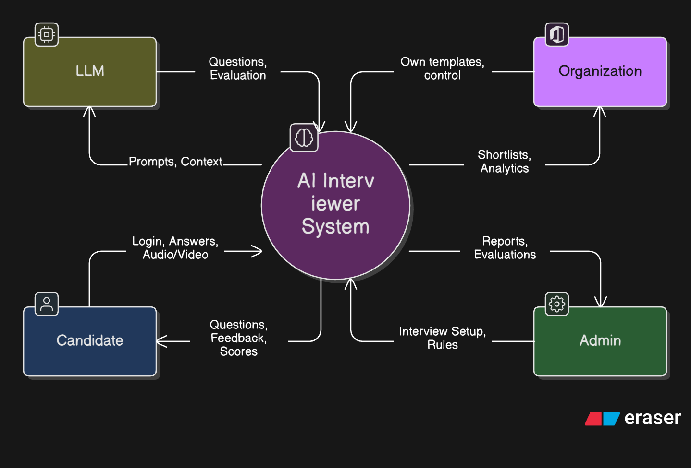
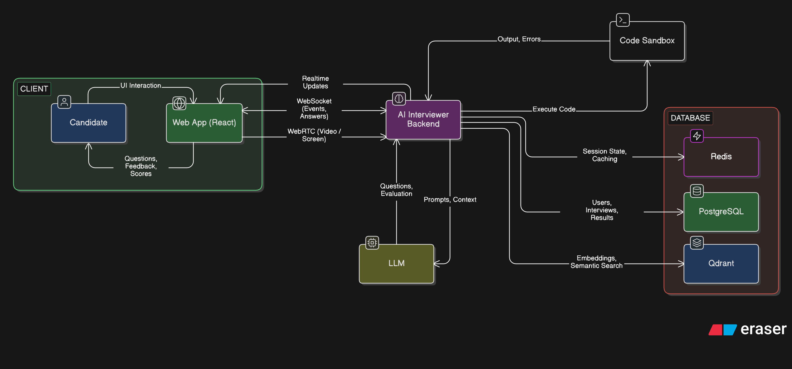
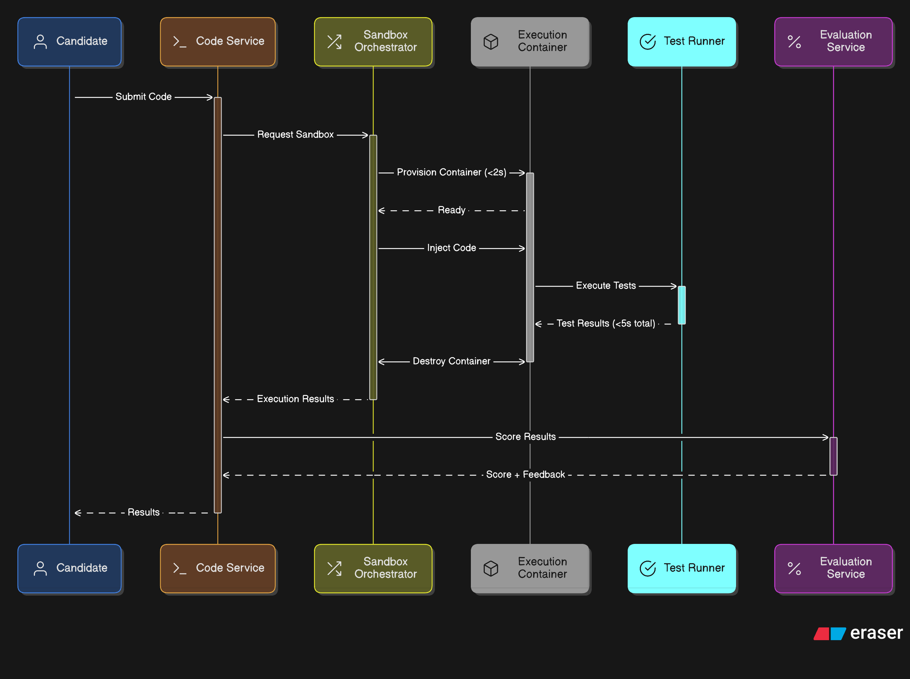
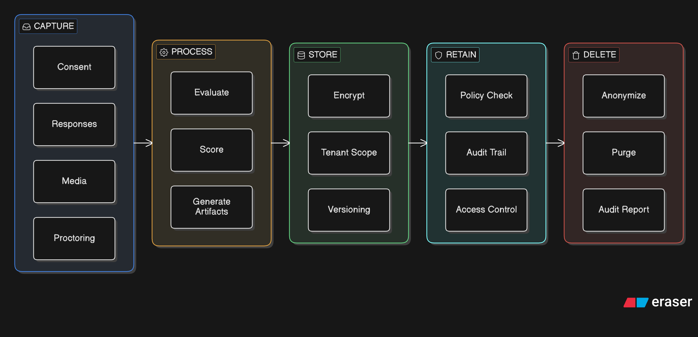
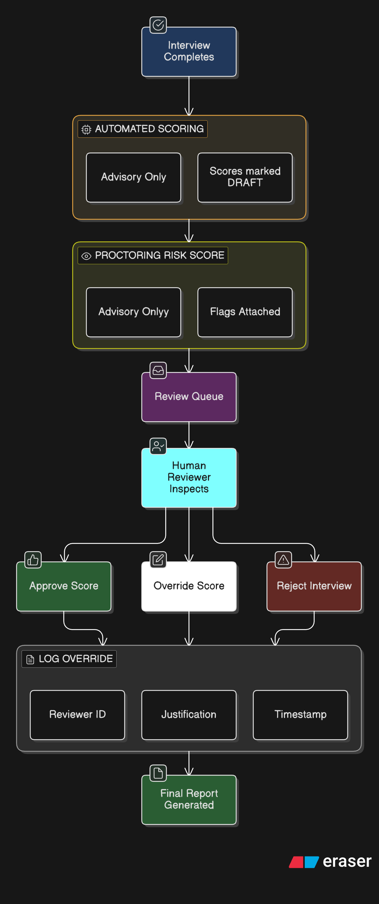
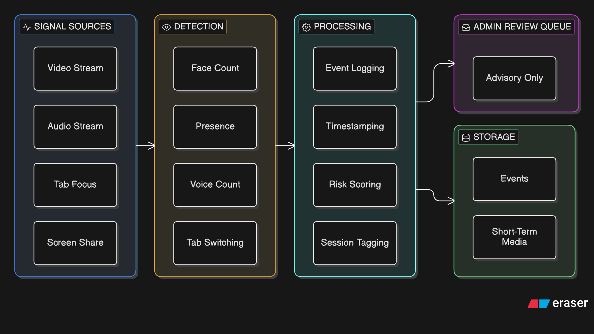
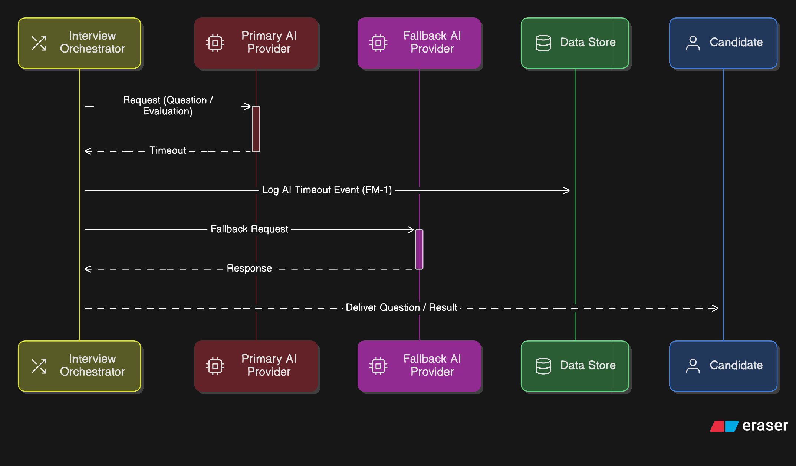
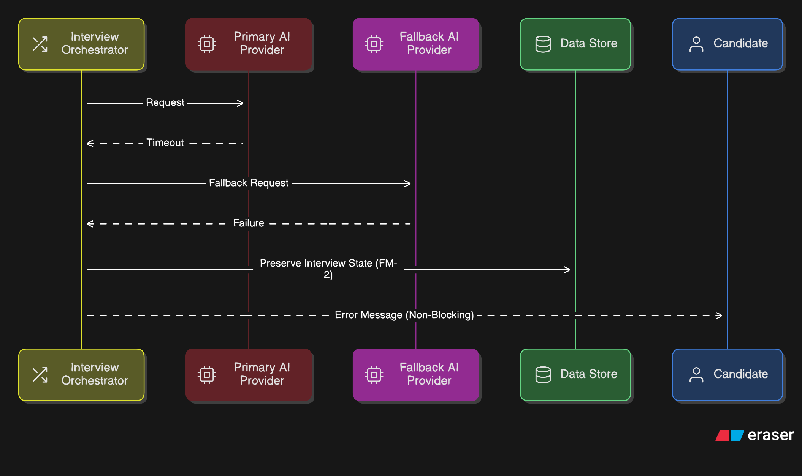

## Software Requirements Specification (SRS)

---

## Document Control

**Document Title:** AI Interviewer System — Software Requirements Specification  
**Revision:** 1.0  
**Status:** Baseline Draft  
**Date:** 2026-01-25  
**Owner:** AI Interviewer Team

### Change History

| Version | Date       | Description          | Author              |
| ------- | ---------- | -------------------- | ------------------- |
| 1.0     | 2026-01-25 | Initial baseline SRS | AI Interviewer Team |

---

## 1. Introduction

### 1.1 Purpose

This document specifies the **functional and non-functional requirements** for the AI Interviewer System.  
It serves as the authoritative reference for **design, implementation, validation, testing, and scope control**.

This SRS intentionally **does not prescribe architecture or technology choices**, except where explicitly stated as constraints.

---

### 1.2 Scope

The AI Interviewer System is a **web-based interview platform** that supports:

- Technical and non-technical interviews
- Multimodal interaction (text, voice, optional video)
- AI-assisted question generation and evaluation
- Coding assessments in a controlled environment
- Proctoring signals for integrity (advisory only)
- Reporting, analytics, and administrative governance

The system is intended for **assessment and training support**, not autonomous hiring decisions.

---

### 1.3 Definitions, Acronyms, Abbreviations

| Term       | Definition                                         |
| ---------- | -------------------------------------------------- |
| LLM        | Large Language Model                               |
| RBAC       | Role-Based Access Control                          |
| STT        | Speech-to-Text                                     |
| TTS        | Text-to-Speech                                     |
| WebRTC     | Browser-based real-time media transport            |
| IDE        | Browser-based Integrated Development Environment   |
| Tenant     | Logical organization with isolated data            |
| Proctoring | Collection of integrity-related signals (advisory) |

---

### 1.4 References

- IEEE 29148 — Software Requirements Specification
- OWASP ASVS — Application Security Verification Standard
- GDPR — General Data Protection Regulation
- NIST AI RMF — AI Risk Management Framework
- WCAG 2.1 — Web Content Accessibility Guidelines

---

### 1.5 Document Overview

This document is structured as follows:

| Section                                          | Title                       | Description                                                                                                                 |
| ------------------------------------------------ | --------------------------- | --------------------------------------------------------------------------------------------------------------------------- |
| [1](#1-introduction)                             | Introduction                | Purpose, scope, definitions, references                                                                                     |
| [2](#2-overall-description)                      | Overall Description         | Product perspective, functions, users, constraints                                                                          |
| [3](#3-external-interface-requirements)          | External Interfaces         | UI, hardware, software, communication interfaces                                                                            |
| [4](#4-system-features-functional-requirements)  | Functional Requirements     | Core system features ([FR-1](#41-interview-scope--stakeholders) – [FR-9](#49-proctoring--integrity))                        |
| [5](#5-non-functional-requirements)              | Non-Functional Requirements | Performance, security, privacy, ethics ([NFR-1](#51-performance-requirements) – [NFR-14](#510-human-oversight))             |
| [6](#6-data-requirements)                        | Data Requirements           | Entities, storage, retention, versioning ([DR-1](#62-data-storage-requirements) – [DR-10](#64-data-versioning--provenance)) |
| [7](#7-negative-requirements-prohibitions)       | Negative Requirements       | Explicit prohibitions ([NR-1](#7-negative-requirements-prohibitions) – [NR-5](#7-negative-requirements-prohibitions))       |
| [8](#8-failure-mode-requirements)                | Failure-Mode Requirements   | Error handling and recovery ([FM-1](#8-failure-mode-requirements) – [FM-5](#8-failure-mode-requirements))                   |
| [9](#9-use-cases-normative-summary)              | Use Cases                   | Normative behavioral descriptions                                                                                           |
| [10](#10-acceptance--validation-criteria)        | Acceptance Criteria         | Validation evidence requirements                                                                                            |
| [11](#11-traceability-matrix)                    | Traceability Matrix         | Requirement-to-test mapping                                                                                                 |
| [12](#12-prioritization-summary)                 | Prioritization              | Mandatory, recommended, optional, out-of-scope                                                                              |
| [13](#13-compliance-statement)                   | Compliance                  | Standards alignment                                                                                                         |
| [Appendix A](#appendix-a-diagram-specifications) | Diagrams                    | System context, flows, data lifecycle                                                                                       |

---

## 2. Overall Description

### 2.1 Product Perspective

The system is a **multi-tenant cloud application** providing interview orchestration, AI-assisted evaluation, and administrative oversight.

The system integrates external AI services but retains **full control over scoring, logging, and decision boundaries**.

---

### 2.2 Product Functions (Summary)

The system provides the following high-level capabilities:

- User and tenant management
- Interview scheduling and execution
- Adaptive question selection
- Multimodal interaction
- Coding assessment with test cases
- Scoring, feedback, and reporting
- Proctoring signal collection
- Administrative configuration and analytics

---

### 2.3 User Classes

| User Class            | Description                                |
| --------------------- | ------------------------------------------ |
| Candidate             | Participates in interviews and assessments |
| Interviewer / Trainer | Reviews sessions and outcomes              |
| Administrator         | Manages configuration, access, and reports |
| Organization / CRC    | Owns tenant-specific data and policies     |

---

### 2.4 Operating Environment

The system shall operate as a **browser-accessible web application** requiring:

- Internet connectivity
- Browser permissions for audio/video/screen capture (where enabled)

No client-side installation is required.

---

### 2.5 Design & Implementation Constraints

- Multi-tenant data isolation
- Privacy-first data handling
- Human-in-the-loop decision enforcement
- Sandboxed execution for untrusted code
- Regulated data retention and deletion

---

### 2.6 Assumptions & Dependencies

- External AI providers may exhibit latency or variability
- Proctoring signals are advisory, not deterministic
- External APIs are subject to rate limits and availability

---

## 3. External Interface Requirements

### 3.1 User Interfaces

The system shall provide a responsive web interface including:

- Candidate dashboard
- Interview session interface
- Coding environment
- Feedback and reports
- Administrative console

---

### 3.2 Hardware Interfaces

- Camera, microphone, and screen capture via browser APIs
- Optional GPU acceleration for AI inference

---

### 3.3 Software Interfaces

The system shall integrate with:

- AI model providers via abstract adapters
- Speech processing engines for STT/TTS
- Persistent storage systems
- In-memory coordination services
- Real-time communication protocols

_Specific technologies are non-normative._

---

### 3.4 Communications Interfaces

- HTTPS for API communication
- WebSockets for real-time events
- Secure real-time media transport protocols

---

## 4. System Features (Functional Requirements)

> **Requirement Keywords**  
> _Shall_ = mandatory  
> _Should_ = recommended  
> _Could_ = optional  
> _Shall not_ = prohibited

---

### 4.1 Interview Scope & Stakeholders

- **FR-1.1:** The system shall support interviews across defined role categories including technical and non-technical roles.
- **FR-1.2:** The system shall support single-tenant and multi-tenant operation with strict data isolation. → _See [NFR-7.1](#54-security-requirements)_
- **FR-1.3:** The system shall provide role-based access for Candidates, Interviewers, Administrators, and Organizations. → _See [Section 2.3](#23-user-classes)_
- **FR-1.4:** The system shall allow tenant-specific interview configuration and templates. → _See [FR-8.5](#48-knowledge-base-management)_

---

### 4.2 Interview Types, Modes & Flow

- **FR-2.1:** The system should support multiple interview types (e.g., algorithmic, system design, behavioral).
- **FR-2.2:** The system could support practice and assessment modes.
- **FR-2.3:** The system shall allow administrators to schedule interviews within defined access windows. → _See [UC-2](#uc-2-administrator-schedules-interviews)_
- **FR-2.4:** The system should support a dynamic interview flow (ask → evaluate → adapt). → _See [Diagram D2](#diagram-d2-interview-flow-sequence)_
- **FR-2.5:** The system shall enforce time limits per question and per interview session.

---

### 4.3 Candidate Profiling & Personalization

- **FR-3.1:** The system should capture candidate profile metadata relevant to interview configuration.
- **FR-3.2:** The system should adapt question difficulty based on candidate performance. → _See [FR-4.4](#44-question-management)_
- **FR-3.3:** The system should select interview templates based on profile metadata.

---

### 4.4 Question Management

- **FR-4.1:** The system should manage a tagged repository of static questions. → _See [FR-8.2](#48-knowledge-base-management)_
- **FR-4.2:** The system shall generate interview questions using AI models guided by templates. → _See [NFR-2](#51-performance-requirements) for latency_
- **FR-4.3:** The system should support difficulty categorization and progression.
- **FR-4.4:** The system shall log all difficulty adaptation decisions with inputs and outcomes. → _See [NFR-11](#57-maintainability--observability)_
- **FR-4.5:** The system should prevent repetition of identical or semantically similar questions within a session. → _See [DR-2](#62-data-storage-requirements)_

---

### 4.5 Multimodal Interaction

- **FR-5.1:** The system shall support text-based interviews.
- **FR-5.2:** The system shall support voice-based interviews. → _See [Section 3.3](#33-software-interfaces)_
- **FR-5.3:** The system should support optional video-based interviews.
- **FR-5.4:** The system could provide basic voice analysis signals.
- **FR-5.5:** The system shall not perform emotion recognition or eye-tracking. → _See [NR-3](#7-negative-requirements-prohibitions)_

---

### 4.6 Evaluation & Feedback

- **FR-6.1:** The system should evaluate responses using predefined rubrics. → _See [NFR-10](#56-ethics-bias--explainability-enforceable)_
- **FR-6.2:** The system shall compute rubric-based scores per response.
- **FR-6.3:** The system should aggregate scores across an interview.
- **FR-6.4:** The system shall generate post-interview feedback. → _See [UC-1](#uc-1-candidate-takes-scheduled-interview)_
- **FR-6.5:** The system shall log evaluation inputs, outputs, and model identifiers. → _See [NFR-10.1](#56-ethics-bias--explainability-enforceable)_
- **FR-6.6:** The system shall require explicit human review before any consequential decision. → _See [NFR-14](#510-human-oversight), [NR-1](#7-negative-requirements-prohibitions)_

---

### 4.7 Coding Assessment

- **FR-7.1:** The system shall provide a browser-based coding environment. → _See [UC-1](#uc-1-candidate-takes-scheduled-interview)_
- **FR-7.2:** The system should support multiple programming languages.
- **FR-7.3:** The system should execute code in an isolated environment. → _See [NR-5](#7-negative-requirements-prohibitions), [FM-3](#8-failure-mode-requirements)_
- **FR-7.4:** The system shall evaluate code using visible and hidden test cases.
- **FR-7.5:** The system could analyze code quality metrics.

---

### 4.8 Knowledge Base Management

- **FR-8.1:** The system should support import of external question datasets.
- **FR-8.2:** The system shall store and manage a tagged repository of interview questions.
- **FR-8.3:** The system shall allow administrators to enable, disable, or archive question sets. → _See [UC-4](#uc-4-knowledge-base-management)_
- **FR-8.4:** The system could generate questions from job descriptions or role specifications.
- **FR-8.5:** The system shall store tenant-specific interview patterns and configuration templates. → _See [FR-1.4](#41-interview-scope--stakeholders)_

---

### 4.9 Proctoring & Integrity

> Proctoring signals are **advisory only** and shall not trigger autonomous decisions. See [NR-1](#7-negative-requirements-prohibitions), [NFR-14](#510-human-oversight).

- **FR-9.1:** The system should detect and log tab/window switching during interview sessions.
- **FR-9.2:** The system should support optional screen recording during interviews.
- **FR-9.3:** The system could detect candidate presence/absence in video frame.
- **FR-9.4:** The system could detect multiple faces in video frame.
- **FR-9.5:** The system could detect audio anomalies (e.g., multiple voices).
- **FR-9.6:** The system shall log all proctoring events with timestamps and session identifiers.
- **FR-9.7:** The system should compute a configurable risk score based on proctoring signals.
- **FR-9.8:** The system shall provide an administrative review queue for flagged sessions. → _See [UC-3](#uc-3-reviewer-inspects-interview)_
- **FR-9.9:** The system shall enforce configurable retention and deletion policies for proctoring artifacts. → _See [DR-7](#63-data-retention--deletion)_
- **FR-9.10:** The system shall not perform emotion recognition or eye-tracking. → _See [FR-5.5](#45-multimodal-interaction)_

---

## 5. Non-Functional Requirements

### 5.1 Performance Requirements

- **NFR-1:** The system shall respond to non-media user interactions within **300 ms** at the 95th percentile under nominal load.
- **NFR-2:** The system shall return an AI-generated response or a fallback response within **5 seconds** at the 95th percentile.
  - **NFR-2.1:** If the primary AI provider exceeds **4 seconds**, the system shall invoke a configured fallback provider or cached response.
  - **NFR-2.2:** The system shall log response latency, provider identity, and fallback activation for every AI request.
- **NFR-3:** The coding execution environment shall initialize within **2 seconds** and complete test execution within **5 seconds** for typical workloads (≤1000 LOC, ≤10 test cases).

---

### 5.2 Scalability & Concurrency

- **NFR-4:** The system shall support at least **2,000 concurrent active client connections** (e.g., active interview sessions) under nominal load.
  - **NFR-4.1:** The system shall support horizontal scaling without requiring client-side session loss.
  - **NFR-4.2:** Interview session state shall be recoverable following transient service failures.

---

### 5.3 Reliability & Availability

- **NFR-5:** The system shall achieve **≥99% monthly availability**, excluding outages caused by external AI providers.
- **NFR-6:** The system shall support session resumption after temporary network disconnections where feasible.
  - **NFR-6.1:** Partial interview artifacts (answers, scores, logs) shall not be lost due to client disconnects.

---

### 5.4 Security Requirements

- **NFR-7:** The system shall enforce authentication and authorization using token-based mechanisms and role-based access control.
  - **NFR-7.1 (Multi-Tenancy):** Tenant data shall be logically isolated and non-queryable across tenants at all times.
  - **NFR-7.2:** All persistent storage of sensitive metadata shall be encrypted at rest.
  - **NFR-7.3:** All data in transit shall be encrypted using industry-standard protocols.
- **NFR-8:** Secrets and credentials shall not be embedded in source code and shall be centrally managed.
  - **NFR-8.1:** The system shall align with OWASP ASVS Level 2 controls at minimum.

---

### 5.5 Privacy & Data Protection

- **NFR-9:** The system shall capture explicit user consent prior to interview initiation.
  - **NFR-9.1:** The system shall collect and retain only data necessary for defined interview and reporting purposes.
  - **NFR-9.2:** The system shall support configurable data retention and deletion policies per tenant.
  - **NFR-9.3:** The system shall encrypt personally identifiable information both at rest and in transit.
  - **NFR-9.4:** The system shall provide mechanisms to delete or anonymize candidate data upon authorized request.

---

### 5.6 Ethics, Bias & Explainability (Enforceable)

> _This section intentionally defines **constraints**, not values._

- **NFR-10:** The system shall generate an **evaluation explanation artifact** for each scored response, including:
  - Rubric dimensions applied
  - Score contribution per dimension
  - AI model identifier used
  * **NFR-10.1:** The system shall log all evaluation inputs and outputs required for audit and reproducibility.

  * **NFR-10.2:** The system shall exclude protected attributes (e.g., age, gender, ethnicity) and proxy signals from automated scoring.

  * **NFR-10.3:** Any tenant-enabled deviation from attribute exclusion shall require explicit configuration and audit logging.

  * **NFR-10.4:** The system shall generate periodic anonymized variance reports comparing score distributions across cohorts.

---

### 5.7 Maintainability & Observability

- **NFR-11:** The system shall produce structured logs for:
  - Interview events
  - Evaluation decisions
  - Proctoring signals
  - Administrative actions

  - **NFR-11.1:** Logs shall include timestamps, tenant identifiers, and correlation identifiers.

  - **NFR-11.2:** Audit logs shall be immutable once written.

---

### 5.8 Portability

- **NFR-12:** The system shall support deployment using containerized services.
  - **NFR-12.1:** Environment-specific configuration shall be externalized from application code.

---

### 5.9 Accessibility

- **NFR-13:** The user interface shall conform to **WCAG 2.1 AA** accessibility guidelines where feasible.
  - **NFR-13.1:** The system shall support captions or transcripts for audio-based interactions where enabled.

---

### 5.10 Human Oversight

- **NFR-14:** Automated scoring and proctoring outputs shall be advisory only.
  - **NFR-14.1:** Authorized human reviewers shall be able to override or amend scores prior to finalization.
  - **NFR-14.2:** All overrides shall be logged with reviewer identity and justification.

---

## 6. Data Requirements

> See [Diagram D4: Data Lifecycle](#diagram-d4-data-lifecycle-diagram) for visualization.

### 6.1 Data Entities

The system shall manage the following entities:

| Entity                              | Related Requirements                                                                         |
| ----------------------------------- | -------------------------------------------------------------------------------------------- |
| Users                               | [FR-1.3](#41-interview-scope--stakeholders), [Section 2.3](#23-user-classes)                 |
| Tenants / Organizations             | [FR-1.2](#41-interview-scope--stakeholders), [NFR-7.1](#54-security-requirements)            |
| Roles & Permissions                 | [FR-1.3](#41-interview-scope--stakeholders), [NFR-7](#54-security-requirements)              |
| Interviews                          | [FR-2.3](#42-interview-types-modes--flow), [UC-1](#uc-1-candidate-takes-scheduled-interview) |
| Questions (static and AI-generated) | [FR-4.1](#44-question-management), [FR-4.2](#44-question-management)                         |
| Answers                             | [FR-6.2](#46-evaluation--feedback)                                                           |
| Scores                              | [FR-6.2](#46-evaluation--feedback), [FR-6.5](#46-evaluation--feedback)                       |
| Feedback                            | [FR-6.4](#46-evaluation--feedback)                                                           |
| Templates                           | [FR-1.4](#41-interview-scope--stakeholders), [FR-8.5](#48-knowledge-base-management)         |
| Proctoring Events                   | [FR-9.6](#49-proctoring--integrity)                                                          |
| Audit Logs                          | [NFR-11](#57-maintainability--observability)                                                 |
| Embeddings                          | [FR-4.5](#44-question-management)                                                            |

---

### 6.2 Data Storage Requirements

- **DR-1:** Relational data shall be stored in a transactional datastore.
- **DR-2:** Semantic similarity data shall be stored in a vector-based datastore. → _Supports [FR-4.5](#44-question-management)_
- **DR-3:** Transient session state shall be stored in an in-memory or ephemeral datastore. → _Supports [NFR-6](#53-reliability--availability)_
- **DR-4:** Media artifacts (audio/video/screen) shall be stored in object-based storage. → _Supports [FR-9.2](#49-proctoring--integrity)_
- **DR-5:** All data stores shall enforce tenant scoping. → _Enforces [NFR-7.1](#54-security-requirements)_

---

### 6.3 Data Retention & Deletion

- **DR-6:** Retention periods shall be configurable per tenant. → _See [NFR-9.2](#55-privacy--data-protection)_
- **DR-7:** Proctoring media shall have shorter default retention than interview metadata. → _See [FR-9.9](#49-proctoring--integrity)_
- **DR-8:** The system shall support automated deletion workflows and generate deletion audit reports. → _See [NFR-9.4](#55-privacy--data-protection)_

---

### 6.4 Data Versioning & Provenance

- **DR-9:** Interview templates and question sets shall be versioned. → _Supports [FR-8.3](#48-knowledge-base-management)_
- **DR-10:** AI-generated questions and evaluations shall be archived with provenance metadata (timestamp, model identifier). → _Supports [FR-6.5](#46-evaluation--feedback), [NFR-10.1](#56-ethics-bias--explainability-enforceable)_

---

## 7. Negative Requirements (Prohibitions)

> These requirements define what the system **shall not** do. See also [NFR-14](#510-human-oversight) for human oversight constraints.

- **NR-1:** The system shall not make autonomous hiring or pass/fail decisions. → _Enforces [FR-6.6](#46-evaluation--feedback)_
- **NR-2:** The system shall not store or process biometric identity data. → _See [NFR-9](#55-privacy--data-protection)_
- **NR-3:** The system shall not infer psychological, medical, or behavioral traits. → _See [FR-5.5](#45-multimodal-interaction)_
- **NR-4:** The system shall not expose tenant data across tenant boundaries. → _Enforces [NFR-7.1](#54-security-requirements)_
- **NR-5:** The system shall not execute untrusted code outside isolated environments. → _Enforces [FR-7.3](#47-coding-assessment)_

---

## 8. Failure-Mode Requirements

> These requirements define system behavior during error conditions. See [Diagram D7](#diagram-d7-failure-handling-sequence-optional) for visualization.

- **FM-1:** If an AI provider fails or times out, the system shall attempt a fallback provider and log the event. → _See [NFR-2.1](#51-performance-requirements)_
- **FM-2:** If all AI providers fail, the system shall present a user-friendly error and preserve session state. → _See [NFR-6](#53-reliability--availability)_
- **FM-3:** If a coding execution exceeds limits, the system shall terminate execution and return a timeout result. → _See [FR-7.3](#47-coding-assessment), [NFR-3](#51-performance-requirements)_
- **FM-4:** If real-time connectivity is lost, the system shall attempt automatic reconnection for up to **30 seconds**. → _See [NFR-6.1](#53-reliability--availability)_
- **FM-5:** If proctoring services are unavailable, interviews shall continue with proctoring marked as unavailable. → _See [FR-9.6](#49-proctoring--integrity)_

---

## 9. Use Cases (Normative Summary)

> Use cases describe **externally observable behavior** and support validation.
> Detailed workflows are non-normative.

### UC-1: Candidate Takes Scheduled Interview

**Primary Actor:** Candidate (see [Section 2.3](#23-user-classes))

**Preconditions:**

- Candidate authenticated ([NFR-7](#54-security-requirements))
- Interview window active ([FR-2.3](#42-interview-types-modes--flow))
- Consent not yet captured ([NFR-9](#55-privacy--data-protection))

**Main Flow:**

1. Candidate logs in
2. System captures explicit consent ([NFR-9](#55-privacy--data-protection))
3. Candidate joins interview session
4. System presents questions sequentially ([FR-4.2](#44-question-management))
5. Candidate responds (text / voice / code) ([FR-5.1](#45-multimodal-interaction), [FR-7.1](#47-coding-assessment))
6. System evaluates responses and adapts flow ([FR-6.2](#46-evaluation--feedback), [FR-4.4](#44-question-management))
7. Interview concludes ([FR-2.5](#42-interview-types-modes--flow))
8. System generates feedback and report ([FR-6.4](#46-evaluation--feedback))

**Postconditions:**

- Interview artifacts stored ([NFR-11](#57-maintainability--observability))
- Scores logged ([FR-6.5](#46-evaluation--feedback))
- Report available for authorized users

**Related Diagrams:** [D2: Interview Flow](#diagram-d2-interview-flow-sequence), [D3: Coding Assessment](#diagram-d3-coding-assessment-sequence)

---

### UC-2: Administrator Schedules Interviews

**Primary Actor:** Administrator (see [Section 2.3](#23-user-classes))

**Related Requirements:** [FR-2.3](#42-interview-types-modes--flow), [FR-1.4](#41-interview-scope--stakeholders), [FR-8.5](#48-knowledge-base-management)

**Main Flow:**

1. Define interview window ([FR-2.3](#42-interview-types-modes--flow))
2. Assign interview template ([FR-1.4](#41-interview-scope--stakeholders))
3. Configure proctoring options ([FR-9.1](#49-proctoring--integrity)–[FR-9.5](#49-proctoring--integrity))
4. Invite candidates

---

### UC-3: Reviewer Inspects Interview

**Primary Actor:** Interviewer / Reviewer (see [Section 2.3](#23-user-classes))

**Related Requirements:** [FR-6.6](#46-evaluation--feedback), [NFR-14](#510-human-oversight), [FR-9.8](#49-proctoring--integrity)

**Main Flow:**

1. View interview session
2. Inspect answers, scores, and proctoring events ([FR-9.6](#49-proctoring--integrity))
3. Override scores if authorized ([NFR-14.1](#510-human-oversight))
4. Add review notes ([NFR-14.2](#510-human-oversight))

**Related Diagrams:** [D5: Human Oversight Flow](#diagram-d5-human-oversight-flow)

---

### UC-4: Knowledge Base Management

**Primary Actor:** Administrator (see [Section 2.3](#23-user-classes))

**Related Requirements:** [FR-8.1](#48-knowledge-base-management)–[FR-8.5](#48-knowledge-base-management)

**Main Flow:**

1. Import or edit question sets ([FR-8.1](#48-knowledge-base-management), [FR-8.2](#48-knowledge-base-management))
2. Tag questions by topic and difficulty ([FR-4.1](#44-question-management))
3. Enable or disable datasets ([FR-8.3](#48-knowledge-base-management))

---

## 10. Acceptance & Validation Criteria

> Acceptance criteria define **objective evidence** that requirements are met.

### Functional Acceptance

- **Interview Timing ([FR-2.5](#42-interview-types-modes--flow)):**
  Given an active interview, the system enforces per-question and total time limits and logs violations.

- **Difficulty Adaptation ([FR-4.4](#44-question-management)):**
  Given performance thresholds are met, the next question difficulty changes and the decision is logged with inputs.

- **Evaluation Logging ([FR-6.5](#46-evaluation--feedback)):**
  For each evaluated response, the system logs rubric dimensions, model identifier, inputs, and outputs.

- **Human Oversight ([FR-6.6](#46-evaluation--feedback)):**
  An authorized reviewer can modify any score prior to report finalization.

- **Coding Sandbox ([FR-7.4](#47-coding-assessment)):**
  Code submissions are executed in isolation, evaluated against visible and hidden tests, and results are stored.

- **Proctoring Logging ([FR-9.6](#49-proctoring--integrity)):**
  All proctoring events are logged with timestamps and session identifiers.

- **Knowledge Base ([FR-8.3](#48-knowledge-base-management)):**
  Administrators can enable, disable, or archive question sets with changes tracked.

---

### Non-Functional Acceptance

- **Performance ([NFR-1](#51-performance-requirements), [NFR-2](#51-performance-requirements)):**
  Load testing demonstrates response times within defined percentiles under nominal load.

- **Concurrency ([NFR-4](#52-scalability--concurrency)):**
  System supports ≥2,000 concurrent sessions with ≥99% success rate.

- **Tenant Isolation ([NFR-7.1](#54-security-requirements)):**
  Security testing confirms no cross-tenant data access is possible.

- **Retention Enforcement ([DR-6](#63-data-retention--deletion)–[DR-8](#63-data-retention--deletion)):**
  Expired data is deleted automatically and deletion events are auditable.

- **Consent Capture ([NFR-9](#55-privacy--data-protection)):**
  System captures explicit consent prior to interview initiation.

- **Human Override ([NFR-14](#510-human-oversight)):**
  Reviewers can override scores with logged justification.

---

## 11. Traceability Matrix

> Full matrix may be maintained as a living artifact.

| Requirement                                   | Use Case                                          | Validation                   | Section                                    |
| --------------------------------------------- | ------------------------------------------------- | ---------------------------- | ------------------------------------------ |
| [FR-2.3](#42-interview-types-modes--flow)     | [UC-2](#uc-2-administrator-schedules-interviews)  | Admin scheduling test        | [4.2](#42-interview-types-modes--flow)     |
| [FR-4.2](#44-question-management)             | [UC-1](#uc-1-candidate-takes-scheduled-interview) | Question generation log      | [4.4](#44-question-management)             |
| [FR-4.4](#44-question-management)             | [UC-1](#uc-1-candidate-takes-scheduled-interview) | Adaptation decision audit    | [4.4](#44-question-management)             |
| [FR-6.6](#46-evaluation--feedback)            | [UC-3](#uc-3-reviewer-inspects-interview)         | Override workflow test       | [4.6](#46-evaluation--feedback)            |
| [FR-7.4](#47-coding-assessment)               | [UC-1](#uc-1-candidate-takes-scheduled-interview) | Sandbox execution test       | [4.7](#47-coding-assessment)               |
| [NFR-4](#52-scalability--concurrency)         | [UC-1](#uc-1-candidate-takes-scheduled-interview) | Load & stress testing        | [5.2](#52-scalability--concurrency)        |
| [NFR-7.1](#54-security-requirements)          | UC-All                                            | Security isolation test      | [5.4](#54-security-requirements)           |
| [NR-1](#7-negative-requirements-prohibitions) | [UC-3](#uc-3-reviewer-inspects-interview)         | Review enforcement test      | [7](#7-negative-requirements-prohibitions) |
| [FM-1](#8-failure-mode-requirements)          | [UC-1](#uc-1-candidate-takes-scheduled-interview) | AI fallback simulation       | [8](#8-failure-mode-requirements)          |
| [FR-8.3](#48-knowledge-base-management)       | [UC-4](#uc-4-knowledge-base-management)           | Dataset management test      | [4.8](#48-knowledge-base-management)       |
| [FR-9.6](#49-proctoring--integrity)           | [UC-1](#uc-1-candidate-takes-scheduled-interview) | Proctoring event logging     | [4.9](#49-proctoring--integrity)           |
| [FR-9.8](#49-proctoring--integrity)           | [UC-3](#uc-3-reviewer-inspects-interview)         | Admin review queue test      | [4.9](#49-proctoring--integrity)           |
| [DR-6](#63-data-retention--deletion)          | UC-All                                            | Retention policy enforcement | [6.3](#63-data-retention--deletion)        |
| [NFR-9](#55-privacy--data-protection)         | [UC-1](#uc-1-candidate-takes-scheduled-interview) | Consent capture validation   | [5.5](#55-privacy--data-protection)        |
| [NFR-14](#510-human-oversight)                | [UC-3](#uc-3-reviewer-inspects-interview)         | Human override workflow      | [5.10](#510-human-oversight)               |

---

## 12. Prioritization Summary

> Requirements are categorized by implementation priority.

### Mandatory (Must Have)

| Category            | Requirements                                                                                                            |
| ------------------- | ----------------------------------------------------------------------------------------------------------------------- |
| Interview Execution | [FR-2.3](#42-interview-types-modes--flow), [FR-2.5](#42-interview-types-modes--flow), [FR-4.2](#44-question-management) |
| Scoring & Feedback  | [FR-6.2](#46-evaluation--feedback), [FR-6.4](#46-evaluation--feedback), [FR-6.5](#46-evaluation--feedback)              |
| Logging & Audit     | [NFR-11](#57-maintainability--observability), [FR-4.4](#44-question-management)                                         |
| Tenant Isolation    | [NFR-7.1](#54-security-requirements), [NR-4](#7-negative-requirements-prohibitions)                                     |
| Human Oversight     | [FR-6.6](#46-evaluation--feedback), [NFR-14](#510-human-oversight), [NR-1](#7-negative-requirements-prohibitions)       |
| Sandboxed Execution | [FR-7.1](#47-coding-assessment), [FR-7.4](#47-coding-assessment), [NR-5](#7-negative-requirements-prohibitions)         |
| Consent & Privacy   | [NFR-9](#55-privacy--data-protection), [NFR-9.1](#55-privacy--data-protection)                                          |

### Recommended (Should Have)

| Category              | Requirements                                                                                                             |
| --------------------- | ------------------------------------------------------------------------------------------------------------------------ |
| Adaptive Difficulty   | [FR-3.2](#43-candidate-profiling--personalization), [FR-4.3](#44-question-management), [FR-4.4](#44-question-management) |
| Dashboards & Reports  | [FR-6.4](#46-evaluation--feedback)                                                                                       |
| Multi-Language Coding | [FR-7.2](#47-coding-assessment)                                                                                          |
| Concurrency Scaling   | [NFR-4](#52-scalability--concurrency)                                                                                    |
| Video Support         | [FR-5.3](#45-multimodal-interaction)                                                                                     |
| Proctoring            | [FR-9.1](#49-proctoring--integrity)–[FR-9.8](#49-proctoring--integrity)                                                  |

### Optional (Could Have)

| Category              | Requirements                                                             |
| --------------------- | ------------------------------------------------------------------------ |
| Voice Analytics       | [FR-5.4](#45-multimodal-interaction)                                     |
| Presence Detection    | [FR-9.3](#49-proctoring--integrity), [FR-9.4](#49-proctoring--integrity) |
| Advanced Code Metrics | [FR-7.5](#47-coding-assessment)                                          |
| JD-Based Questions    | [FR-8.4](#48-knowledge-base-management)                                  |

### Explicitly Out of Scope

| Item                        | Prohibiting Requirement                                                             |
| --------------------------- | ----------------------------------------------------------------------------------- |
| Autonomous hiring decisions | [NR-1](#7-negative-requirements-prohibitions)                                       |
| Biometric identification    | [NR-2](#7-negative-requirements-prohibitions)                                       |
| Emotion recognition         | [FR-5.5](#45-multimodal-interaction), [NR-3](#7-negative-requirements-prohibitions) |
| Offline execution           | Out of scope                                                                        |
| Competitive leaderboards    | Out of scope                                                                        |

---

## 13. Compliance Statement

This SRS aligns with the following standards:

| Standard        | Alignment                                  | Related Requirements                                                                                                                 |
| --------------- | ------------------------------------------ | ------------------------------------------------------------------------------------------------------------------------------------ |
| **IEEE-29148**  | Document structure and requirements format | All sections                                                                                                                         |
| **OWASP ASVS**  | Security controls                          | [NFR-7](#54-security-requirements), [NFR-8](#54-security-requirements), [NR-5](#7-negative-requirements-prohibitions)                |
| **GDPR**        | Data protection principles                 | [NFR-9](#55-privacy--data-protection), [DR-6](#63-data-retention--deletion)–[DR-8](#63-data-retention--deletion)                     |
| **NIST AI RMF** | AI governance guidance                     | [NFR-10](#56-ethics-bias--explainability-enforceable), [NFR-14](#510-human-oversight), [NR-1](#7-negative-requirements-prohibitions) |
| **WCAG 2.1**    | Accessibility                              | [NFR-13](#59-accessibility)                                                                                                          |

---

## 14. Final Notes

- This document defines **what the system must do**, not how it is built.
- Architectural and deployment decisions are documented separately.
- Any change to scope or requirements requires a revision update.
- Diagram specifications are provided in [Appendix A](#appendix-a-diagram-specifications).

---

## Appendix A: Diagram Specifications

> This appendix provides **detailed specifications** for diagrams that support this SRS.
> Diagrams are supporting artifacts and do not constitute requirements.
> Each diagram includes: purpose, actors/components, data flows, and related requirements.

---

### Diagram D1: System Context Diagram

**Purpose:** Illustrate the system boundary and external entities that interact with the AI Interviewer System.

**Type:** Context Diagram (C4 Level 1)

**Related Requirements:** [FR-1.1](#41-interview-scope--stakeholders), [FR-1.2](#41-interview-scope--stakeholders), [FR-1.4](#41-interview-scope--stakeholders), [Section 3](#3-external-interface-requirements)

**Actors & External Systems:**

| Entity       | Type            | Icon     | Description                                                |
| ------------ | --------------- | -------- | ---------------------------------------------------------- |
| Candidate    | Actor           | user     | End user taking interviews, provides answers and media     |
| Admin        | Actor           | settings | Configures interviews, sets rules, reviews reports         |
| Organization | Actor           | office   | Owns tenant-specific templates, controls data and policies |
| LLM          | External System | cpu      | AI services for question generation and evaluation         |

**Diagram**

<!--  -->

**Data Flows:**

| From         | To           | Data                        | Protocol         |
| ------------ | ------------ | --------------------------- | ---------------- |
| Candidate    | System       | Login, Answers, Audio/Video | HTTPS, WebSocket |
| System       | Candidate    | Questions, Feedback, Scores | HTTPS, WebSocket |
| Admin        | System       | Interview Setup, Rules      | HTTPS            |
| System       | Admin        | Reports, Evaluations        | HTTPS            |
| Organization | System       | Own templates, control      | HTTPS            |
| System       | Organization | Shortlists, Analytics       | HTTPS            |
| System       | LLM          | Prompts, Context            | HTTPS (REST)     |
| LLM          | System       | Questions, Evaluation       | HTTPS (REST)     |

---

### Diagram D2: High Level Architecture

**Purpose:** Show the high-level system architecture and runtime interaction between components during an interview session.

**Type:** Architecture Diagram

**Related Requirements:** [FR-2.4](#42-interview-types-modes--flow), [FR-4.2](#44-question-management), [FR-5.1](#45-multimodal-interaction), [FR-6.2](#46-evaluation--feedback), [FR-7.1](#47-coding-assessment), [FM-1](#8-failure-mode-requirements), [DR-1](#62-data-storage-requirements) – [DR-3](#62-data-storage-requirements)

**Components:**

| Component              | Icon     | Role                                                |
| ---------------------- | -------- | --------------------------------------------------- |
| AI Interviewer Backend | brain    | Core orchestration, session management, API gateway |
| LLM                    | cpu      | AI services for question generation and evaluation  |
| Code Sandbox           | terminal | Isolated environment for code execution             |
| PostgreSQL             | database | Relational storage for users, interviews, results   |
| Qdrant                 | layers   | Vector database for embeddings and semantic search  |
| Redis                  | zap      | In-memory store for session state and caching       |
| Web App (React)        | browser  | Client-side user interface                          |
| Candidate              | user     | End user interacting with the system                |

**Diagram:**

<!--  -->

**Data Flows:**

| From                   | To                     | Data                            | Protocol / Transport |
| ---------------------- | ---------------------- | ------------------------------- | -------------------- |
| Candidate              | Web App (React)        | UI Interaction                  | Browser Events       |
| Web App (React)        | Candidate              | Questions, Feedback, Scores     | UI Render            |
| Web App (React)        | AI Interviewer Backend | Events, Answers (bidirectional) | WebSocket            |
| Web App (React)        | AI Interviewer Backend | Video / Screen streams          | WebRTC               |
| AI Interviewer Backend | Web App (React)        | Realtime Updates                | WebSocket            |
| AI Interviewer Backend | PostgreSQL             | Users, Interviews, Results      | SQL                  |
| AI Interviewer Backend | Qdrant                 | Embeddings, Semantic Search     | gRPC / REST          |
| AI Interviewer Backend | Redis                  | Session State, Caching          | Redis Protocol       |
| AI Interviewer Backend | LLM                    | Prompts, Context                | HTTPS (REST)         |
| LLM                    | AI Interviewer Backend | Questions, Evaluation           | HTTPS (REST)         |
| AI Interviewer Backend | Code Sandbox           | Execute Code                    | Internal API         |
| Code Sandbox           | AI Interviewer Backend | Output, Errors                  | Internal API         |

**Alternative Flows:**

| Condition                 | Handling                             | Reference                                                                     |
| ------------------------- | ------------------------------------ | ----------------------------------------------------------------------------- |
| AI Provider Timeout (>4s) | Invoke fallback provider             | [FM-1](#8-failure-mode-requirements), [NFR-2.1](#51-performance-requirements) |
| All Providers Fail        | Display error, preserve state        | [FM-2](#8-failure-mode-requirements)                                          |
| Time Limit Exceeded       | End session, generate partial report | [FR-2.5](#42-interview-types-modes--flow)                                     |
| Code Execution Timeout    | Terminate container, return timeout  | [FM-3](#8-failure-mode-requirements), [NFR-3](#51-performance-requirements)   |

---

### Diagram D3: Code Execution & Evaluation Flow

**Purpose:** Detail the code submission, execution, and evaluation flow for coding assessments.

**Type:** Sequence Diagram

**Related Requirements:** [FR-7.1](#47-coding-assessment) – [FR-7.4](#47-coding-assessment), [NR-5](#7-negative-requirements-prohibitions), [FM-3](#8-failure-mode-requirements), [NFR-3](#51-performance-requirements)

**Participants:**

| Participant          | Icon         | Role                                              |
| -------------------- | ------------ | ------------------------------------------------- |
| Candidate            | user         | Submits code via browser-based coding environment |
| Code Service         | terminal     | Handles code submission and orchestrates flow     |
| Sandbox Orchestrator | shuffle      | Manages container lifecycle and isolation         |
| Execution Container  | box          | Isolated environment for untrusted code execution |
| Test Runner          | check-circle | Executes visible and hidden test cases            |
| Evaluation Service   | percent      | Computes scores and generates feedback            |

**Diagram:**

<!--  -->

**Sequence Flow:**

| Step | From                 | To                   | Action                      | Timing      |
| ---- | -------------------- | -------------------- | --------------------------- | ----------- |
| 1    | Candidate            | Code Service         | Submit Code                 | —           |
| 2    | Code Service         | Sandbox Orchestrator | Request Sandbox             | —           |
| 3    | Sandbox Orchestrator | Execution Container  | Provision Container         | < 2 seconds |
| 4    | Execution Container  | Sandbox Orchestrator | Ready                       | —           |
| 5    | Sandbox Orchestrator | Execution Container  | Inject Code                 | —           |
| 6    | Execution Container  | Test Runner          | Execute Tests               | —           |
| 7    | Test Runner          | Execution Container  | Test Results                | < 5 seconds |
| 8    | Sandbox Orchestrator | Execution Container  | Destroy Container           | —           |
| 9    | Sandbox Orchestrator | Code Service         | Execution Results           | —           |
| 10   | Code Service         | Evaluation Service   | Score Results               | —           |
| 11   | Evaluation Service   | Code Service         | Score + Feedback            | —           |
| 12   | Code Service         | Candidate            | Results (scores & feedback) | —           |

**Security Constraints (per [NR-5](#7-negative-requirements-prohibitions)):**

- Container is isolated with no network access
- Resource limits enforced (CPU, memory, time)
- No persistent storage access
- Syscall restrictions applied
- Container destroyed immediately after execution

**Timeout Handling (per [FM-3](#8-failure-mode-requirements)):**

- Container provisioning must complete within 2 seconds
- Total test execution must complete within 5 seconds
- If execution exceeds limits, container is terminated
- Partial results returned with timeout indicator
- Event logged for audit

---

### Diagram D4: Data Lifecycle Diagram

**Purpose:** Illustrate data flow from capture through retention and deletion.

**Type:** Data Flow Diagram (DFD Level 1)

**Related Requirements:** [Section 6](#6-data-requirements), [DR-6](#63-data-retention--deletion) – [DR-8](#63-data-retention--deletion), [NFR-9](#55-privacy--data-protection)

**Lifecycle Stages:**

<!--  -->

**Data Categories & Retention:**

| Data Type          | Storage           | Default Retention      | Deletion Trigger         |
| ------------------ | ----------------- | ---------------------- | ------------------------ |
| Interview Metadata | Relational DB     | Per tenant policy      | Policy expiry or request |
| Answers & Scores   | Relational DB     | Per tenant policy      | Policy expiry or request |
| Proctoring Media   | Object Storage    | Shorter (configurable) | Policy expiry            |
| Audit Logs         | Append-only Store | Extended (regulatory)  | Regulatory period        |
| Embeddings         | Vector DB         | Tied to source data    | Source deletion          |

**Privacy Controls (per [NFR-9](#55-privacy--data-protection)):**

- Explicit consent captured before data collection
- PII encrypted at rest and in transit
- Anonymization available on request
- Deletion workflows generate audit reports

---

### Diagram D5: Human Oversight Flow

**Purpose:** Show the path from automated scoring to human review and final decision.

**Type:** Activity/Flow Diagram

**Related Requirements:** [FR-6.6](#46-evaluation--feedback), [NFR-14](#510-human-oversight), [NR-1](#7-negative-requirements-prohibitions), [UC-3](#uc-3-reviewer-inspects-interview)

**Flow Description:**

<!--  -->

**Key Constraint:** No automated score becomes final without human approval ([NR-1](#7-negative-requirements-prohibitions)).

---

### Diagram D6: Proctoring Signal Flow (Optional)

**Purpose:** Show how proctoring signals are collected, processed, and surfaced for review.

**Type:** Data Flow Diagram

**Related Requirements:** [FR-9.1](#49-proctoring--integrity) – [FR-9.10](#49-proctoring--integrity), [FM-5](#8-failure-mode-requirements)

**Flow:**
<!--  -->

**Important:** All proctoring outputs are **advisory only** ([NFR-14](#510-human-oversight)). Proctoring unavailability does not block interviews ([FM-5](#8-failure-mode-requirements)).

---

### Diagram D7: Failure Handling Sequence (Optional)

**Purpose:** Illustrate system behavior during AI provider failures.

**Type:** Sequence Diagram

**Related Requirements:** [FM-1](#8-failure-mode-requirements), [FM-2](#8-failure-mode-requirements), [NFR-2](#51-performance-requirements)

**Sequence:**

<!--  -->

**All-Fail Scenario:**

<!--  -->

---

## Appendix B: Requirement Index

> Quick navigation to all requirements.

### Functional Requirements

| ID                                                                                                      | Section | Description                    |
| ------------------------------------------------------------------------------------------------------- | ------- | ------------------------------ |
| [FR-1.1](#41-interview-scope--stakeholders) – [FR-1.4](#41-interview-scope--stakeholders)               | 4.1     | Interview Scope & Stakeholders |
| [FR-2.1](#42-interview-types-modes--flow) – [FR-2.5](#42-interview-types-modes--flow)                   | 4.2     | Interview Types, Modes & Flow  |
| [FR-3.1](#43-candidate-profiling--personalization) – [FR-3.3](#43-candidate-profiling--personalization) | 4.3     | Candidate Profiling            |
| [FR-4.1](#44-question-management) – [FR-4.5](#44-question-management)                                   | 4.4     | Question Management            |
| [FR-5.1](#45-multimodal-interaction) – [FR-5.5](#45-multimodal-interaction)                             | 4.5     | Multimodal Interaction         |
| [FR-6.1](#46-evaluation--feedback) – [FR-6.6](#46-evaluation--feedback)                                 | 4.6     | Evaluation & Feedback          |
| [FR-7.1](#47-coding-assessment) – [FR-7.5](#47-coding-assessment)                                       | 4.7     | Coding Assessment              |
| [FR-8.1](#48-knowledge-base-management) – [FR-8.5](#48-knowledge-base-management)                       | 4.8     | Knowledge Base Management      |
| [FR-9.1](#49-proctoring--integrity) – [FR-9.10](#49-proctoring--integrity)                              | 4.9     | Proctoring & Integrity         |

### Non-Functional Requirements

| ID                                                                              | Section | Description                     |
| ------------------------------------------------------------------------------- | ------- | ------------------------------- |
| [NFR-1](#51-performance-requirements) – [NFR-3](#51-performance-requirements)   | 5.1     | Performance                     |
| [NFR-4](#52-scalability--concurrency)                                           | 5.2     | Scalability & Concurrency       |
| [NFR-5](#53-reliability--availability) – [NFR-6](#53-reliability--availability) | 5.3     | Reliability & Availability      |
| [NFR-7](#54-security-requirements) – [NFR-8](#54-security-requirements)         | 5.4     | Security                        |
| [NFR-9](#55-privacy--data-protection)                                           | 5.5     | Privacy & Data Protection       |
| [NFR-10](#56-ethics-bias--explainability-enforceable)                           | 5.6     | Ethics, Bias & Explainability   |
| [NFR-11](#57-maintainability--observability)                                    | 5.7     | Maintainability & Observability |
| [NFR-12](#58-portability)                                                       | 5.8     | Portability                     |
| [NFR-13](#59-accessibility)                                                     | 5.9     | Accessibility                   |
| [NFR-14](#510-human-oversight)                                                  | 5.10    | Human Oversight                 |

### Other Requirements

| ID                                                                                            | Section | Description               |
| --------------------------------------------------------------------------------------------- | ------- | ------------------------- |
| [DR-1](#62-data-storage-requirements) – [DR-10](#64-data-versioning--provenance)              | 6       | Data Requirements         |
| [NR-1](#7-negative-requirements-prohibitions) – [NR-5](#7-negative-requirements-prohibitions) | 7       | Negative Requirements     |
| [FM-1](#8-failure-mode-requirements) – [FM-5](#8-failure-mode-requirements)                   | 8       | Failure-Mode Requirements |

---

_End of Document_
